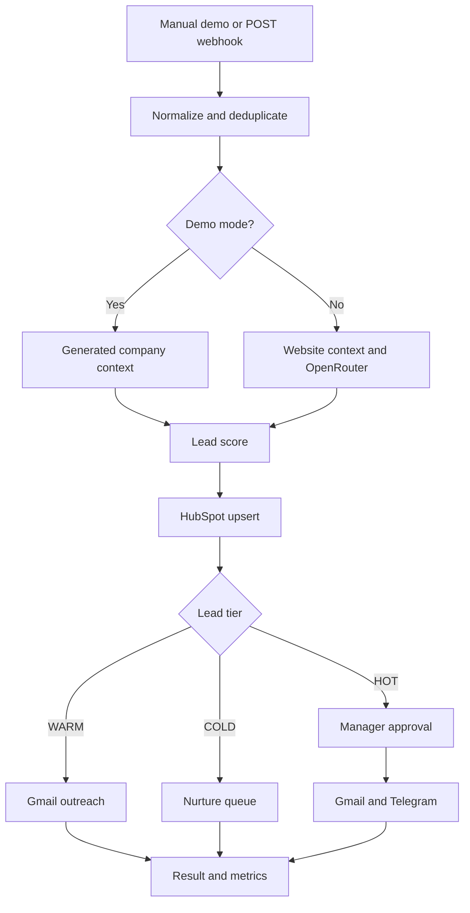

# RevenueFlow — AI Lead Qualification and Outreach

[Русская версия](README_RU.md) · [Architecture](docs/ARCHITECTURE.md) · [Setup](docs/SETUP.md) · [Data contract](docs/DATA_CONTRACT.md)

An n8n workflow for validating inbound B2B leads, enriching company context, calculating lead priority, updating HubSpot, and routing personalized outreach.

## What the workflow does

1. Accepts a lead from a manual demo or a `POST` webhook.
2. Normalizes fields and validates contact data, intent, and consent.
3. Creates a fingerprint to prevent repeated processing.
4. Retrieves company context from the submitted website.
5. Requests a structured company assessment from OpenRouter.
6. Calculates a 100-point lead score from explicit rules and AI fit.
7. Creates or updates the HubSpot contact.
8. Generates personalized outreach.
9. Requests manager approval before sending to HOT leads.
10. Sends WARM outreach automatically and routes COLD leads to nurture.

## Architecture



## Scoring model

| Component | Maximum |
| --- | ---: |
| Budget | 30 |
| Timeline | 20 |
| Company size | 15 |
| Business email | 10 |
| AI fit | 20 |
| Data completeness | 5 |

`HOT` starts at 75 points, `WARM` at 50 points, and lower scores are routed to `COLD`.

## Demo

1. Import [`workflows/revenueflow-ai-lead-qualification.json`](workflows/revenueflow-ai-lead-qualification.json) into n8n.
2. Leave `REVENUEFLOW_DEMO_MODE` unset or set it to `true`.
3. Click **Run Demo**.
4. Inspect **Record Metrics and Return Result**.

The demo uses fictional lead data and simulates CRM, email, approval, and Telegram actions.

## Live configuration

Follow [SETUP.md](docs/SETUP.md) to configure OpenRouter, HubSpot, Gmail, Telegram, webhook protection, and the `REVENUEFLOW_*` variables. Set `REVENUEFLOW_DEMO_MODE=false` after the live credentials and destination IDs are assigned.

## Repository structure

```text
workflows/       n8n workflow file
sample-data/     example leads and approval payloads
docs/            architecture, setup, and data contract
scripts/         local workflow checks
tests/           automated tests
```

## License

See [LICENSE](LICENSE).
