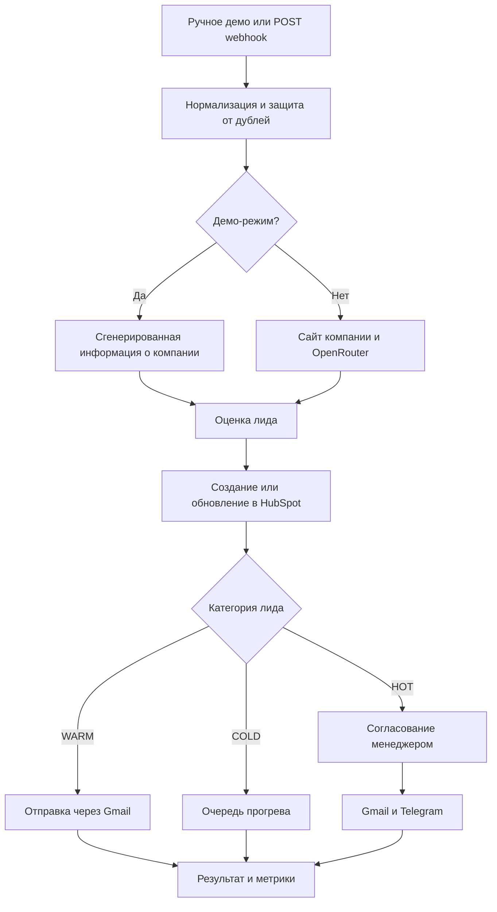

# RevenueFlow — AI-квалификация лидов и персонализированные сообщения

[English version](README.md) · [Архитектура](docs/ARCHITECTURE.md) · [Настройка](docs/SETUP.md) · [Структура данных](docs/DATA_CONTRACT.md)

Workflow n8n для проверки входящих B2B-лидов, сбора информации о компании, расчёта приоритета, обновления HubSpot и отправки персонализированных сообщений.

## Что делает workflow

1. Получает лид из ручного демо или `POST` webhook.
2. Нормализует поля и проверяет контактные данные, запрос и согласие.
3. Создаёт отпечаток для защиты от повторной обработки.
4. Получает информацию с сайта компании.
5. Запрашивает структурированную оценку компании через OpenRouter.
6. Рассчитывает оценку лида по шкале 0–100.
7. Создаёт или обновляет контакт в HubSpot.
8. Формирует персонализированное сообщение.
9. Запрашивает согласование перед отправкой HOT-лиду.
10. Автоматически отправляет сообщения WARM-лидам и переводит COLD-лиды в очередь прогрева.

## Архитектура



## Модель оценки

| Компонент | Максимум |
| --- | ---: |
| Бюджет | 30 |
| Срок принятия решения | 20 |
| Размер компании | 15 |
| Корпоративная почта | 10 |
| Соответствие по оценке AI | 20 |
| Полнота данных | 5 |

Категория `HOT` начинается с 75 баллов, `WARM` — с 50, остальные лиды получают категорию `COLD`.

## Демонстрационный запуск

1. Импортируйте [`workflows/revenueflow-ai-lead-qualification.json`](workflows/revenueflow-ai-lead-qualification.json) в n8n.
2. Оставьте `REVENUEFLOW_DEMO_MODE` пустым или установите `true`.
3. Нажмите **Run Demo**.
4. Посмотрите результат в **Record Metrics and Return Result**.

Демонстрация использует вымышленные данные и имитирует действия CRM, почты, согласования и Telegram.

## Рабочая настройка

В [SETUP.md](docs/SETUP.md) описана настройка OpenRouter, HubSpot, Gmail, Telegram, защиты webhook и переменных `REVENUEFLOW_*`. После добавления credentials и ID получателей установите `REVENUEFLOW_DEMO_MODE=false`.

## Структура репозитория

```text
workflows/       файл workflow n8n
sample-data/     примеры лидов и ответов согласования
docs/            архитектура, настройка и структура данных
scripts/         локальные технические проверки
tests/           автоматические тесты
```

## Лицензия

См. [LICENSE](LICENSE).
