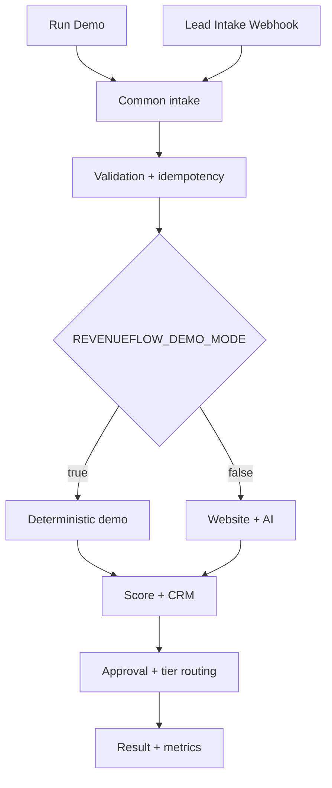
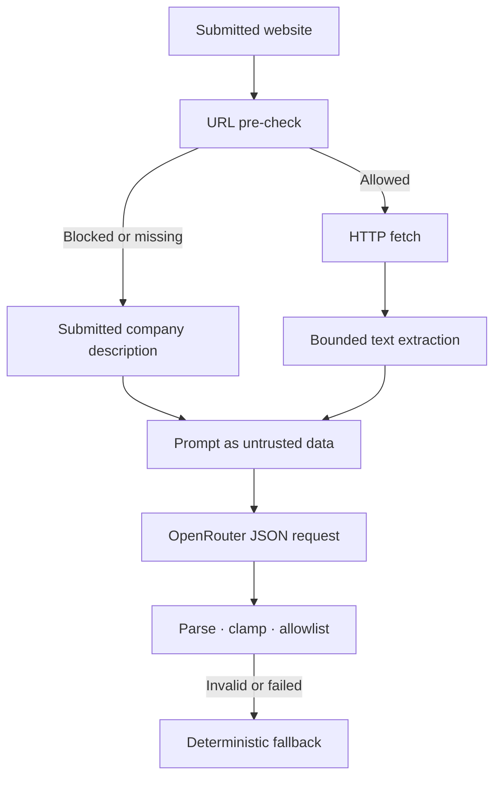

# Architecture

## System boundary

RevenueFlow is one n8n workflow with two entry points and a shared processing pipeline. The manual trigger runs the included demo. The webhook accepts live intake, and external actions are isolated behind the live-mode branch.

## Processing stages

| Stage | Main nodes | Responsibility | Output invariant |
| --- | --- | --- | --- |
| Intake | `Load Demo Lead`, `Lead Intake Webhook`, `Normalize Intake Envelope` | Unify manual and webhook payloads and add request metadata | `lead_raw`, `request_meta` |
| Validation | `Runtime Configuration`, `Validate and Normalize Lead`, `Is Lead Valid?` | Sanitize aliases, bound strings, parse numbers, require consent | Valid normalized `lead` or explicit error result |
| Idempotency | `Create Idempotency Key`, `Is Duplicate Lead?` | Fingerprint email, company, and need; suppress recent replays | `identity.fingerprint`, duplicate decision |
| Intelligence | demo node or website/AI branch | Produce a bounded assessment with deterministic fallback | Valid `ai_assessment` and provider metadata |
| Scoring | `Calculate Deterministic Score` | Apply explicit commercial rules | Score `0..100`, tier and breakdown |
| CRM | simulated branch or HubSpot search/upsert | Create/update the contact once per processed lead | Normalized `crm` result |
| Outreach | `Prepare Personalized Outreach` | Build subject, body, booking CTA, and approval summary | Plain-text message fields |
| Decision | Gmail approval and tier IF nodes | Gate HOT delivery; route WARM and COLD outcomes | Explicit `approval` and `delivery` state |
| Completion | `Record Metrics and Return Result` | Mark fingerprint complete, increment counters, return compact result | Stable result contract |

## Live intelligence branch

The URL check is an application-level pre-filter. A live deployment should also use DNS/IP validation and a network egress policy.

## Tier routing

| Tier | Default threshold | CRM | Human approval | Email | Sales alert |
| --- | ---: | --- | --- | --- | --- |
| HOT | `75–100` | Upsert | Required in live mode | After approval | Telegram |
| WARM | `50–74` | Upsert | Not required | Automatic | Not required |
| COLD | `0–49` | Upsert | Not required | Not sent | Nurture status queued |

## Failure behavior

| Failure | Behavior | Rationale |
| --- | --- | --- |
| Invalid or missing lead data | Stops before external calls with `rejected_invalid_input` | Fail early and cheaply |
| Duplicate fingerprint | Returns `ignored_duplicate` | Avoid repeated CRM/email actions |
| Website fetch error | Continues with empty/submitted context | Enrichment is optional |
| OpenRouter error or invalid JSON | Uses deterministic fallback | Model availability must not own business continuity |
| HubSpot search/upsert error | Execution fails | CRM success is returned only after a confirmed response |
| Approval rejection, timeout, or unknown response | Email is not sent | Fail closed on high-value communication |
| Gmail send error | Execution fails | Never record an unsent message as sent |
| Telegram alert error after HOT email | Records `sales_alert_status: failed` and completes | Preserve delivery truth while avoiding duplicate email retries |

## State model

n8n global workflow static data stores:

- fingerprints with `processing` or `completed` state;
- request ID and last update timestamp;
- final tier and score;
- daily totals for processed HOT, WARM, COLD, and duplicate events.

This model is intentionally small and should be replaced by an atomic external store in horizontally scaled deployments.
